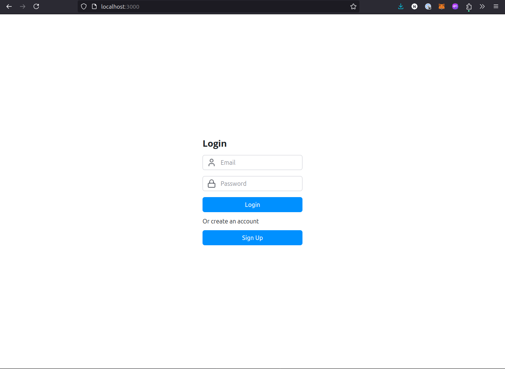
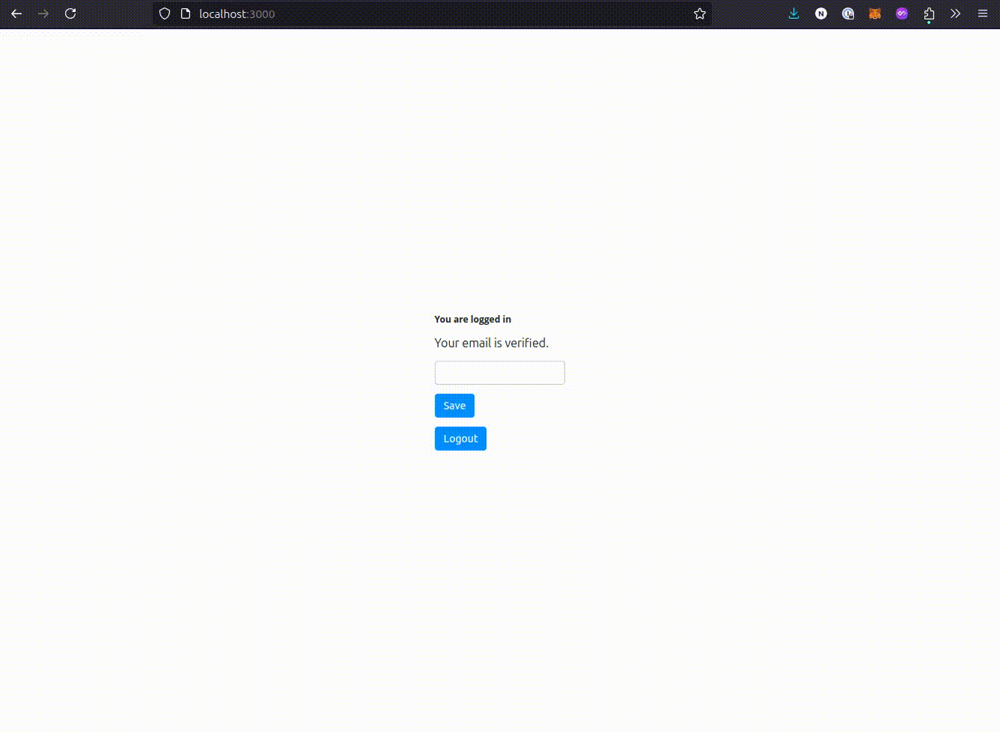

# reflex-firebase

A Reflex custom component firebase.

## Installation

```bash
pip install reflex-firebase
```

## Getting Started

```bash
git clone https://github.com/neka-nat/reflex-firebase.git
cd reflex-firebase
cp .env.sample .env

# FIREBASE_API_KEY=
# FIREBASE_AUTH_DOMAIN=
# FIREBASE_DATABASE_URL=
# FIREBASE_PROJECT_ID=
# FIREBASE_STORAGE_BUCKET=
# FIREBASE_MESSAGING_SENDER_ID=
# FIREBASE_APP_ID=
# FIREBASE_MEASUREMENT_ID=
```

Run demo.

```bash
cd firebase_demo
pip install -r requirements.txt
reflex run
```

### Login form


### Todo demo

